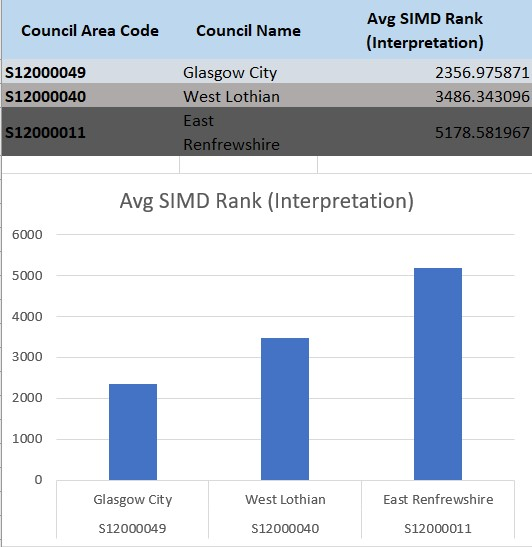
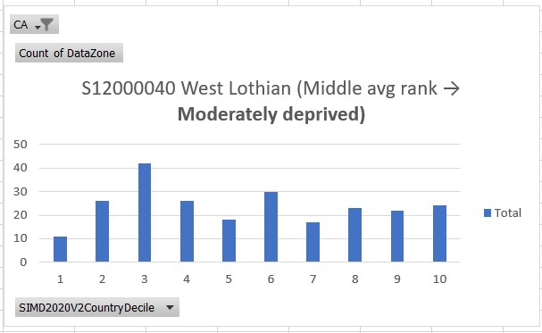

# SIMD2020-Data

## Visualise the distribution of SIMD2020V2CountryDecile values for 3 contrasting council areas.

🧾 Explanation:

### SIMD Rank: Lower values indicate higher deprivation.

- Glasgow City has the lowest average rank, meaning its data zones tend to be more deprived overall.

- West Lothian falls in the middle, representing a moderate level of deprivation.

- East Renfrewshire has the highest average SIMD rank, suggesting it is relatively more affluent.

📊 Policy Implication:
This kind of breakdown helps local authorities prioritize funding and social support, targeting the most deprived areas (like Glasgow City) with anti-poverty, education, and health access initiatives.

.jpg)

.jpg)

